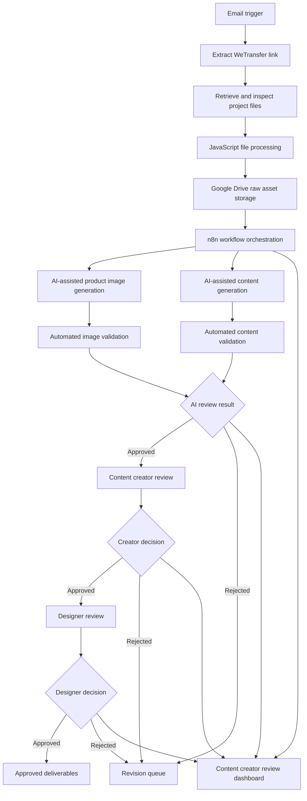

# AURA AI Product Content Workflow

An in-progress automation project for organizing product photography, coordinating AI-assisted content generation, validating outputs, and routing assets through human review.

> **Project status:** Work in progress. The workflow architecture and core automation stages are being developed and refined. It is not yet intended for production use.

## Overview

The AURA workflow is designed to reduce the manual work involved in receiving product photographs, organizing assets, generating product content, reviewing AI outputs, and tracking the status of each product.

n8n acts as the orchestration layer between file intake, JavaScript processing, Google Drive, OpenAI-powered generation and validation, and human review. A dedicated web dashboard lets the content creator review AI-approved image sets and submit a Good or No Good decision.

## Repository Structure

```text
.
├── AURA Atomated Image Generation n8n Workflow/
│   ├── DEV - 01 WeTransfer Intake.json
│   ├── DEV - 02 Raw Footage Preparation Handoff.json
│   ├── DEV - 03 Manual Review Routing.json
│   ├── DEV - 04 Content Creator Review Dashboard Backend.json
│   └── Initialize Aura Drive Structure.json
├── Architecture & Design/
│   └── workflow architecture documents
├── content-creator-review-website/
│   ├── app/
│   ├── public/
│   ├── package.json
│   └── README.md
└── README.md
```

- **n8n workflows:** importable workflow definitions and the Drive initialization workflow.
- **Architecture & Design:** supporting process-flow documentation.
- **Content creator website:** the complete dashboard source, API routes, styling, configuration, and deployment manifest.

## Problem

Product content production involves several connected tasks:

- Receiving raw photography through email and WeTransfer
- Identifying and organizing files for each product
- Preparing images and product information for processing
- Generating product imagery and written content
- Checking outputs against the original references
- Routing approved and rejected assets
- Tracking progress across multiple review stages

Handling these steps manually can make it difficult to maintain consistent file organization, review status, and output quality. This project explores how workflow automation and structured human approval can make that process easier to manage.

## Workflow Architecture



## Main Workflow Stages

### 1 File Intake

The workflow begins when an email containing a WeTransfer link is received. The link is extracted and prepared for file retrieval.

### 2 File Processing and Storage

JavaScript steps inspect and organize the incoming files. Raw assets are stored in a structured Google Drive folder system so that each product can move through the workflow independently.

### 3 AI Assisted Generation

The workflow coordinates AI-assisted product image and content generation. Reference photographs and product information are treated as the source material for each generation task.

### 4 Automated Validation

Generated outputs pass through validation steps before human review. These checks are intended to identify missing files, incorrect formats, incomplete outputs, or results that require another attempt.

### 5 Human Review

The workflow includes approval and rejection stages for content creators and designers. Rejected outputs return to a revision path instead of being treated as completed work.

### 6 Content Creator Dashboard

The content creator dashboard loads pieces from `Content/AIApproved`, displays the four accepted product images, and sends the creator's Good or No Good decision to n8n. n8n then moves the complete piece folder to the appropriate creator-approved or creator-rejected destination.

## Technologies

- **n8n** for workflow orchestration
- **JavaScript** for link, page, and file processing
- **OpenAI tools** for AI-assisted image and content workflows
- **Google Drive** for structured asset storage
- **Next.js/vinext** for the content creator review website
- **Email and WeTransfer** for project intake

## Project Goals

- Build a clear and repeatable product-content workflow
- Reduce repetitive file handling and status updates
- Keep AI generation grounded in real product references
- Add automated checks before human review
- Preserve human approval for final creative decisions
- Make failures and rejected outputs easy to identify and retry

## Current Status

This repository documents an active prototype. Workflow stages may change as testing continues.

Current development areas include:

- Workflow orchestration and file routing
- Product folder organization
- AI generation and validation steps
- Approval and rejection states
- Retry and error-handling logic
- Dashboard status reporting
- Documentation and testing

## Importing the Workflow

1. Download or clone this repository.
2. Open your n8n instance.
3. Create a workflow and select the option to import from a file.
4. Import the JSON files from `AURA Atomated Image Generation n8n Workflow/`.
5. Reconnect the required credentials in n8n.
6. Replace example folder IDs, URLs, and configuration values with values from your environment.
7. Test each stage with non-sensitive sample data before activating the workflow.

## Content Creator Website

The full website source is in `content-creator-review-website/`. Its local and hosted runtime requires these environment variables:

```text
N8N_PIECES_URL
N8N_DECISION_URL
N8N_BASIC_USERNAME
N8N_BASIC_PASSWORD
```

Values belong in a local `.env.local` file or the hosting provider's secret configuration. They must never be committed to GitHub.

```bash
cd content-creator-review-website
npm install
npm run dev
```

## Planned Improvements

- Complete end-to-end workflow testing
- Improve retry and failure handling
- Add clearer execution logging
- Validate duplicate and incomplete file submissions
- Expand automated quality checks
- Complete end-to-end creator dashboard testing
- Add sanitized workflow screenshots and test examples
- Document deployment and maintenance procedures

## Author

**Karim Khalil**


